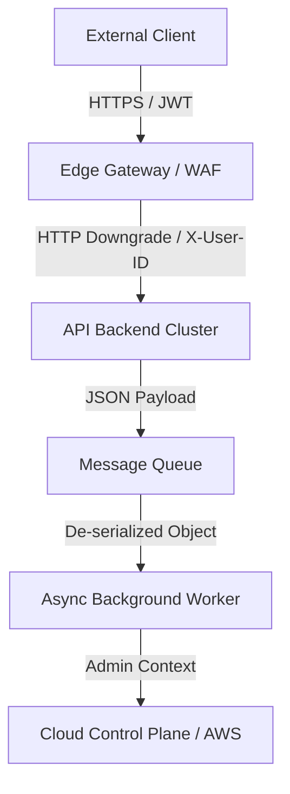

# 07 — DFD Generation (Architecture Synthesis)

## Goal
Synthesize the inferred signals, clusters, and boundaries into a high-confidence **Data Flow Diagram (DFD)** to feed the STRIDE engine.

## DFD Construction Heuristics

### 1. Element Mapping
*   **External Entity:** Represented by the "Browser/Client Cluster".
*   **Process:** Every **Parser Boundary** or **Async Worker** is a process node.
*   **Data Flow:** Represented by **Identity Propagation** paths and **Parser Pipelines**.
*   **Data Store:** Inferred from persistence signals (e.g., `/db-admin`, S3-bucket headers).

### 2. Interaction Definition
For every flow, define:
*   **Source:** Which service initiated the data movement?
*   **Sink:** Which service received and parsed the data?
*   **Context:** What identity token was attached? (JWT, Header, Workload Identity).

### 3. Behavioral AST & Control Flow Graph (CFG) Synthesis (Black-Box Code Property Graph)
When source code is unavailable, construct a **Behavioral Control Flow Graph (CFG)** from HTTP telemetry traces:
*   **Nodes:** Endpoint handlers and state machines (`POST /auth/login`, `GET /dashboard`, `POST /checkout/pay`).
*   **Edges:** Transitions triggered by client requests and session cookies.
*   **Branching:** HTTP response code forks (`200 OK` vs `403 Forbidden` vs `302 Redirect`).
*   **Taint Analysis (Source $\rightarrow$ Sink):** Track user-controlled inputs (query parameters, JSON properties, custom headers) through intermediate API nodes until they hit persistence data stores (SQL/NoSQL) or downstream asynchronous queue workers.

## Automated DFD Template (Hypothesis)

## STRIDE Integration Point
For every node in the synthetic DFD, apply the **[STRIDE Threat Modeling Workflow](../Methodology/STRIDE_Threat_Modeling_Workflow.md)**.

## Operational Output
A structured DFD representation (Mermaid or JSON). This feeds the **Attack Hypothesis Generation**.
