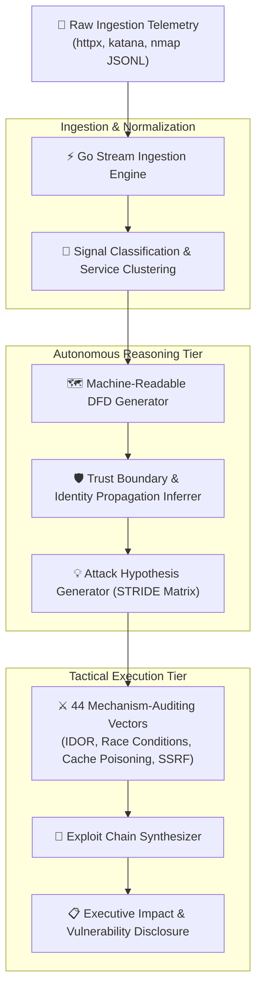

<div align="center">

# 🏛️ ArchHunter: Elite Offensive Architectural Reasoning Engine

### Autonomous Mechanism-First Security Framework & Distributed System Reasoning Engine

[](https://go.dev/)
[](https://www.python.org/)
[](https://grpc.io/)
[](Methodology/STRIDE_Threat_Modeling_Workflow.md)
[](OPERATIONAL_MAP.md)
[](LICENSE)

**Signals Ingestion • DFD Graph Generation • Mechanism Auditing • Exploit Chain Synthesis**

[Reasoning Architecture](#-architectural-reasoning-flow) • [Quick Start](#-quick-start) • [Tactical Playbooks](#-tactical-playbook--workflows) • [Repository Map](#-repository-structure)

</div>

---

## 🎯 Overview

**ArchHunter** is an advanced, mechanism-first offensive security reasoning system designed to identify high-impact, systemic vulnerabilities in complex distributed systems, cloud-native infrastructures, and enterprise web applications.

Rather than relying on shallow automated vulnerability scanners, ArchHunter ingests raw network, web, and infrastructure telemetry (`httpx`, `katana`, `nmap`) and runs an autonomous **Go and Protobuf-driven reasoning pipeline** to deduce the underlying software architecture, map trust boundaries, generate Data Flow Diagrams (DFD), and systematically synthesize multi-stage exploit chains.

---

## 🏗 Architectural Reasoning Flow



---

## ⚡ Quick Start

### 1. Master Agent Doctrine
Start every operational engagement with **[`claude.md`](claude.md)** — the single source of truth for agent identity, the 4-phase offensive doctrine, mandatory operational headers, and ruthless triage rules.

### 2. Follow the 4-Phase Tactical Playbook
Use **[`Methodology/OPERATIONAL_PLAYBOOK.md`](Methodology/OPERATIONAL_PLAYBOOK.md)** for execution guidance:
- **Phase 1: Reconnaissance (Passive & Active)** → [`Workflow/01`](Workflow/01_target_selection.md), [`Workflow/02`](Workflow/02_passive_recon.md), [`Workflow/03`](Workflow/03_active_mapping.md)
- **Phase 2: Architecture & DFD Inference** → [`Workflow/04`](Workflow/04_fingerprint_to_architecture.md), [`Workflow/05`](Workflow/05_attack_surface_expansion.md), [`Architecture_Inference/`](Architecture_Inference/index.md)
- **Phase 3: Mechanism Auditing** → [`Workflow/06`](Workflow/06_manual_validation.md), [`skills/`](skills/_INDEX.md), [`OPERATIONAL_MAP.md`](OPERATIONAL_MAP.md)
- **Phase 4: Exploitation & Impact** → [`Workflow/07`](Workflow/07_chain_building.md), [`Workflow/08`](Workflow/08_impact_modeling.md), [`Workflow/09`](Workflow/09_reporting.md)

### 3. Run the Automated Reasoning Runtime
Analyze recon telemetry (`sample_signals.jsonl`) to automatically infer machine-readable DFDs and prioritize hypotheses:

```bash
cd Runtime
go run cmd/runtime/main.go -input testdata/sample_signals.jsonl -format markdown -output outputs/
```

---

## 📁 Repository Structure

```
ArchHunter/
├── README.md               # Framework overview and architecture (this file)
├── claude.md               # Master AI Agent briefing & execution doctrine
├── OPERATIONAL_MAP.md      # Rapid mechanism pivot index (linking all 47 skills)
├── templates/              # Engagement templates (TARGET_SESSION_TEMPLATE.md)
│
├── Methodology/            # Strategic threat modeling & tactical playbooks
│   ├── OPERATIONAL_PLAYBOOK.md         # Unified 4-Phase tactical manual
│   ├── BUG_BOUNTY_TOOLKIT_PLAYBOOK.md  # Chained toolkit recon & fuzzer pipelines
│   ├── PRACTICAL_BURP_HUNTING_GUIDE.md # 2-account CRUD, race conditions, & logic flaws
│   ├── Architectural_Trust_Boundary_Analysis.md
│   ├── STRIDE_Threat_Modeling_Workflow.md
│   └── Recon_to_Architecture_Mapping.md
│
├── Workflow/               # 9 sequential operational workflows
│   ├── 01_target_selection.md          # Asset filtering & scope ROI
│   ├── 02_passive_recon.md             # Subdomain & ASN passive discovery
│   ├── 03_active_mapping.md            # Port scanning, live probes, tech fingerprinting
│   ├── 04_fingerprint_to_architecture.md # dunder-analysis & cloud infrastructure mapping
│   ├── 05_attack_surface_expansion.md  # Parameter mining, hidden endpoints, JS ripping
│   ├── 06_manual_validation.md         # Root cause confirmation & verification
│   ├── 07_chain_building.md            # Multi-vulnerability pivot chains
│   ├── 08_impact_modeling.md           # Business risk & blast radius calculations
│   └── 09_reporting.md                 # Executive summaries & submission reports
│
├── Architecture_Inference/ # 8 architectural inference heuristics
│   ├── 01_recon_signal_classification.md
│   ├── 02_service_clustering.md
│   ├── 03_trust_boundary_inference.md
│   ├── 04_identity_propagation_mapping.md
│   ├── 05_async_distributed_inference.md
│   ├── 06_parser_pipeline_mapping.md
│   ├── 07_dfd_generation.md
│   └── 08_attack_hypothesis_generation.md
│
├── Runtime/                # Go & Protobuf automated reasoning core
│   ├── cmd/runtime/        # CLI entry point
│   ├── proto/              # Protobuf schemas (Graph, Hypothesis, Orchestration)
│   ├── schemas/            # JSON Schema definitions for architectural entities
│   ├── workers/            # Distributed Python micro-workers (scoring, parser, identity)
│   └── testdata/           # Reusable telemetry datasets
│
└── skills/                 # 47 curated mechanism manuals (4 pillars)
    ├── _INDEX.md           # STRIDE Threat Matrix (all 47 skills indexed)
    ├── _TAXONOMY.md        # Full 4-pillar architectural taxonomy
    ├── auth_logic/         # SAML XSW, IDOR, Pre-ATO, OAuth/SSO, IAM boundaries, Auth bypass
    ├── state_management/   # Financial logic, Rate limiting, Async, Consistency, Race, WebSockets
    ├── infrastructure/     # 403 bypass, NGINX, Webhooks, SSRF, SSTI, File Upload, SQLi, Prototype Pollution
    └── emerging/           # LLM / RAG privilege escalation & AI quota bypasses
```

---

## 📄 License

This research framework is open-source under the [MIT License](LICENSE).
