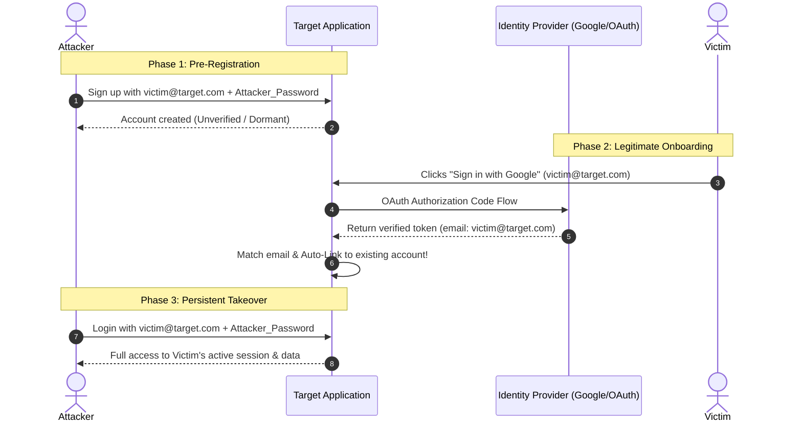

# Mechanism: Pre-Account Takeover (Pre-ATO) & Identity Desync

## 1. Architectural Vulnerability Profile
*   **Vulnerability Class:** Pre-Account Takeover (Pre-ATO) / Account Linking Race
*   **STRIDE Category:** Spoofing, Elevation of Privilege
*   **Trust Boundary Crossed:** External Identity Provider (IdP) $\rightarrow$ Application User Database $\rightarrow$ Local Session Store
*   **Target Architectures:** Apps supporting dual authentication (Password + OAuth/SAML/SSO), social logins, multi-user invitations, and unverified registration flows.

---

## 2. Core Failure Modes (The 4 Attack Variations)

### Variation A: Classic Password-to-OAuth Auto-Linking
1. **Flaw:** The application allows account registration without immediate email verification or allows unverified accounts to persist.
2. **Exploitation:** Attacker registers `victim@company.com` with password `P@ssword123!`. When the victim logs in via "Sign in with Google", the backend automatically merges/links the OAuth identity to the existing row without requiring existing password verification or deleting the old password hash.
3. **Impact:** Attacker logs in at any time with their password, completely bypassing victim's Google 2FA.

### Variation B: Unverified IdP Identity Linking (Forged Email)
1. **Flaw:** Application trusts the `email` claim returned by third-party OAuth providers (e.g. GitHub, Discord, Apple, custom OAuth) without checking `email_verified: true`.
2. **Exploitation:** Attacker sets primary or unverified secondary email on Discord/GitHub to `victim@company.com`, clicks "Log in with Discord" on Target. Target creates/merges victim's profile.

### Variation C: Workspace / Organization Invitation Pre-ATO
1. **Flaw:** Organization invites `victim@company.com` to join private workspace.
2. **Exploitation:** Attacker registers `victim@company.com` on the platform before the victim accepts. The backend binds the workspace membership to the existing email record regardless of creation provenance.

### Variation D: Destructive Email Change & Lockout
1. **Flaw:** User profile allows changing email address without verifying current password or sending a confirmation challenge to the old email.
2. **Exploitation:** Attacker changes victim's email to attacker's mailbox, instantly triggering password reset and locking out the true owner.

---

## 3. Offensive Verification & Audit Checklist

### Burp Suite Testing Steps:
1. **Test Auto-Link Behavior:**
   - Register account with Password: `testuser_victim@yourdomain.com` / `AttackerPass123`.
   - Do NOT click any verification link.
   - Open incognito browser and click `Sign in with Google` using the exact same email `testuser_victim@yourdomain.com`.
   - Check if login succeeds without prompting: *"Enter your existing password to link this account"*.
   - Check if you can STILL log in via original username/password in another tab. If yes $\rightarrow$ **CRITICAL Pre-ATO Confirmed**.

2. **Test IdP Verification Enforcement:**
   - Check OAuth token callback `/auth/callback?code=...` in Burp.
   - Modify payload if JSON Web Token (JWT) or inspect if `email_verified: false` is honored by the application.

---

## 4. Remediation & Defense
1. **Mandatory Explicit Linking:** Never automatically merge OAuth logins with existing password-based accounts. Demand the existing account password before binding a new OAuth identity.
2. **Strict Verification Guard:** Drop unverified pre-registered accounts upon first OAuth sign-in, or force immediate email verification before any session token issuance.
3. **Always Check `email_verified`:** Enforce `email_verified == true` on all IdP claims.
