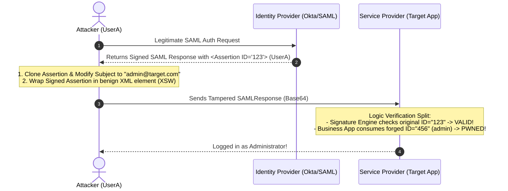

# Mechanism: SAML XML Signature Wrapping (XSW) & SSO Integrity

## 1. Architectural Vulnerability Profile
*   **Vulnerability Class:** XML Signature Wrapping (XSW) / Signature Stripping / Schema Validation Desync
*   **STRIDE Category:** Elevation of Privilege, Spoofing, Tampering
*   **Trust Boundary Crossed:** Identity Provider (IdP e.g., Okta, PingIdentity, Azure AD) $\rightarrow$ Service Provider (SP Application)
*   **Target Architectures:** Enterprise Single Sign-On (SSO), B2B SaaS portals, Okta/SAML 2.0 endpoints (`/saml/sso`, `/auth/saml/callback`).

---

## 2. Core Failure Mechanisms



---

## 3. The 8 XML Signature Wrapping (XSW) Attack Variations

When the SAML Response is signed at the Assertion level or Response level:

| Variant | Attack Anatomy | Vulnerability Explanation |
|---|---|---|
| **XSW 1** | Cloned unsigned assertion added as sibling after signed assertion; signature changed to point to original. | SP verifies signature on original, but logic extracts NameID from the cloned element. |
| **XSW 2** | Cloned unsigned assertion added as sibling *before* the signed assertion. | Parser reads first assertion (`first-child`), validator reads second. |
| **XSW 3** | Cloned assertion copied inside an unsigned extension element, original signature points inside. | Tree confusion between signature scope and DOM extraction. |
| **XSW 4** | Original assertion placed inside a newly constructed `<Response>`, cloned assertion stays at root. | Root element ambiguity. |
| **XSW 5** | Original assertion signature moved to an auxiliary child wrapper. | Signature detached from assertion payload. |
| **XSW 6** | Original assertion placed inside `<ds:Object>` tag of the signature. | Signature validator resolves referenced element inside itself; app reads outer element. |
| **XSW 7** | Cloned assertion placed inside `<ds:Object>` tag of the signature. | Inverse object wrapping. |
| **XSW 8** | Signature element removed, cloned assertion wrapped in newly fabricated assertion. | Root signature validation disabled. |

---

## 4. XML Comment Injection & Truncation

*   **Mechanism:** XML parsers that handle comments differently than string sanitizers in identity backends:
*   **Payload in `<saml:NameID>`:**
    ```xml
    admin<!-- malicious comment -->@target.com
    ```
    *   If parser strips comments before checking: matches `admin@target.com`.
    *   If registrar verifies `admin@attacker.com`: registering `admin@attacker.com<!-- -->target.com` bypasses email verification and resolves to `admin@target.com`.

---

## 5. Signature Stripping & Transform Flaws

1. **Total Signature Removal:**
   - Delete `<ds:Signature>...</ds:Signature>` entirely from the XML.
   - If SP assumes IdP delivered response over TLS and omits asserting signature presence $\rightarrow$ instant authentication bypass as any user.
2. **Canonicalization Algorithm Downgrade:**
   - Tamper transform algorithm from `http://www.w3.org/2001/10/xml-exc-c14n#` to weak transform or empty transform.
3. **Replay Attack:**
   - Replay captured SAML assertion without expiration (`NotOnOrAfter`) check.

---

## 6. Practical Offensive Testing Workflow

1. Intercept `POST /saml/sso` or `/auth/saml/callback`.
2. Decode Base64 `SAMLResponse` parameter using **SAML Raider** (Burp Extension).
3. Test XSW Attacks 1 through 8 automatically via SAML Raider XSW drop-down.
4. Test Signature Stripping: Remove `<ds:Signature>` and change `<saml:NameID>` to `admin@company.com`.
5. Check if IdP allows unsigned assertions over HTTPS.

---

## 7. Remediation & Defense
1. **Enforce Canonicalization and Explicit ID Binding:** Verify XML signature and resolve the exact same DOM node for both validation and identity consumption.
2. **Reject Multiple Assertions:** Disallow SAML responses containing more than one `<saml:Assertion>` tag.
3. **Validate NotBefore & NotOnOrAfter:** Strictly assert timestamps and enforce replay caches for SAML Assertion IDs.
