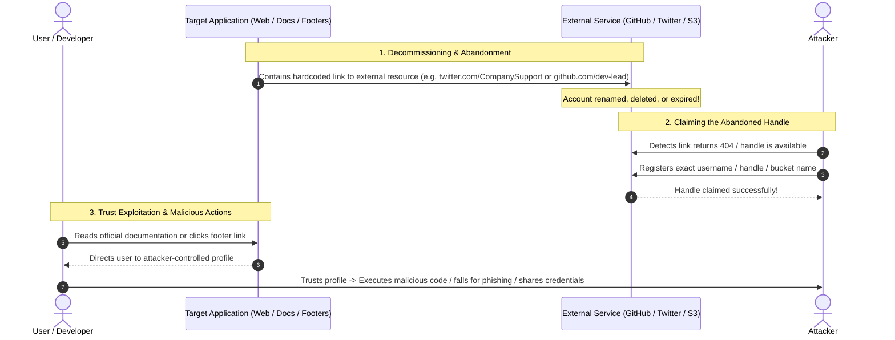

# Mechanism: Broken Link Hijacking (BLH) & Unclaimed Asset Takeover

## 1. Architectural Vulnerability Profile
*   **Vulnerability Class:** Broken Link Hijacking (BLH) / Dangling Social & Documentation Asset Pointer
*   **STRIDE Category:** Spoofing, Elevation of Privilege, Tampering
*   **Trust Boundary Crossed:** Internal Documentation / Application UI $\rightarrow$ External Public Third-Party Namespace (GitHub, Twitter/X, LinkedIn, S3, NPM)
*   **Target Architectures:** Web applications, API documentation portals (Swagger/Redoc), landing page footers, corporate blogs, open-source SDK references.

---

## 2. Core Failure Mechanism



---

## 3. High-Impact Attack Vectors

### Vector A: Documentation Developer Handle Hijacking (Supply-Chain Risk)
*   **Flaw:** Official documentation or code walkthroughs credit or link to an internal engineer's GitHub profile (`github.com/old-dev-name`). If that engineer renames their GitHub account or leaves, the original handle becomes available.
*   **Exploitation:**
    1. Register the abandoned GitHub username.
    2. Clone or recreate repositories referenced in the documentation.
    3. Host malicious releases, backdoored dependencies, or reverse shell one-liners.
    4. Users following official tutorials run attacker-supplied code directly.
*   **Severity:** **High / Critical** (Direct supply-chain poisoning & developer workstation compromise).

### Vector B: Official Social Media Handle Takeover
*   **Flaw:** Website headers/footers or subdomain links point to an inactive or typo-squatted social account (e.g., `x.com/target_support` or `linkedin.com/company/target-inc`).
*   **Exploitation:**
    1. Register the available handle.
    2. Impersonate official support agents or publish phishing links.
*   **Severity:** **Medium / High** (Brand damage, spear-phishing users, credential harvesting).

### Vector C: Dangling CDN & Dependency Links in Static Assets
*   **Flaw:** Application loads third-party scripts from external CDNs or endpoints (e.g. S3 bucket, Bitly shortener, or unmaintained domain).
*   **Exploitation:**
    1. Claim the domain, bucket, or shortlink.
    2. Serve malicious JavaScript causing Stored XSS across the entire target domain.
*   **Severity:** **High / Critical** (Full client-side session takeover).

---

## 4. Offensive Discovery & Verification Workflow

### Step 1: Extract All External Links from Target Scope
Run recursive crawling on live subdomains, documentation pages, and blog endpoints:
```powershell
# Using the automated repo script
pwsh scripts/find_broken_links.ps1 -TargetUrl "https://docs.target.com" -CheckSocial -CheckGitHub
```

### Step 2: Filter for Broken Candidates (HTTP 404 / Dead Endpoints)
Look for external requests returning:
*   GitHub: `404 Not Found`
*   Twitter / X: `This account doesn’t exist`
*   LinkedIn: `Page not found`
*   Bitly: `Branded Short Domain not claimed`

### Step 3: Responsible Proof-of-Concept Verification
*   **DO NOT** hijack active user assets or publish malicious material.
*   Verify that the registration endpoint allows claiming the handle without completing the claim (or register safely with clear bug bounty research attribution).
*   Document the exact page linking to the broken resource and the exact URI.

---

## 5. Defense & Remediation
1. **Automated Link Checking:** Incorporate link integrity checkers in CI/CD before deploying documentation or web footers.
2. **Handle Reservation Policy:** When rebranding or deleting social/GitHub accounts, keep the original handles as dummy placeholders to prevent public re-registration.
3. **Subresource Integrity (SRI):** Enforce SRI hashes on all third-party external scripts.
