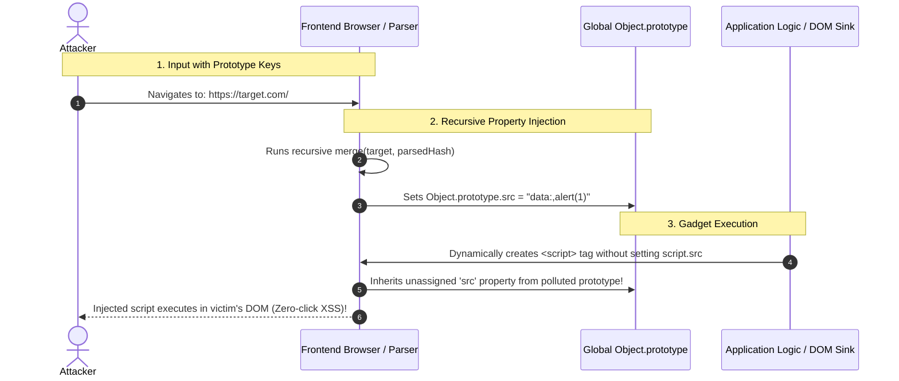

# Mechanism: Prototype Pollution (Client-Side CSPP & Server-Side SSPP)

## 1. Architectural Vulnerability Profile
*   **Vulnerability Class:** Object Prototype Mutation / Prototype Pollution
*   **STRIDE Category:** Tampering, Elevation of Privilege, Information Disclosure
*   **Trust Boundary Crossed:** Untrusted User Input (Query Params / Hash / JSON) $\rightarrow$ JavaScript Object Merger / Property Setter $\rightarrow$ Core `Object.prototype` Runtime
*   **Target Architectures:** Frontend Single Page Applications (React, Vue, Angular, jQuery), Node.js backend runtimes (Express, Koa, Fastify, Lodash, Underscore).

---

## 2. Core Failure Mechanism



---

## 3. High-Impact Attack Variations

### Variation A: Client-Side Prototype Pollution (CSPP) to DOM XSS
*   **Source Inputs:**
    *   Query String: `?__proto__[url]=javascript:alert(1)`
    *   URL Hash: `#__proto__[innerHTML]=`
    *   Constructor syntax: `?constructor[prototype][transport]=javascript:alert(1)`
*   **Common Vulnerable Gadgets:**
    *   Analytics tags (Google Tag Manager, Segment) injecting script tags.
    *   Config objects passed to templating engines (Handlebars, Mustache).
    *   Dynamic script loaders (`document.createElement('script')`).

### Variation B: Server-Side Prototype Pollution (SSPP) to RCE / Auth Bypass
*   **Source Inputs:**
    *   JSON POST bodies:
        ```json
        {
          "__proto__": {
            "isAdmin": true,
            "role": "superadmin"
          }
        }
        ```
*   **Impact:**
    *   **Logic Bypass:** In JavaScript, `if (user.isAdmin)` evaluates to `true` if `user` does not define `isAdmin` explicitly, inheriting from polluted prototype.
    *   **Remote Code Execution (RCE):** Polluting `NODE_OPTIONS`, `shell`, `execPath`, or `env` properties in Node.js child-process spawns (`child_process.fork()` / `child_process.spawn()`).

---

## 4. Detection & Automated Verification

### Browser Console Probing
Open DevTools and inspect if the prototype was modified:
```javascript
// Test URL: https://target.com/?__proto__[polluted_check]=pwned
Object.prototype.polluted_check // If returns "pwned", site is vulnerable!
```

### Payloads for Quick Auditing
```text
#__proto__[polluted]=true
?__proto__[polluted]=true
?__proto__.polluted=true
?constructor[prototype][polluted]=true
?constructor.prototype.polluted=true
```

---

## 5. Remediation & Hardening
1. **Object Freezing:** Call `Object.freeze(Object.prototype);` at application entry.
2. **Prototype-less Objects:** Create dictionary objects with `Object.create(null)` instead of literal `{}`.
3. **Key Stripping:** Sanitize input keys by explicitly dropping `__proto__`, `constructor`, and `prototype`.
4. **Use Map Data Structure:** Use ECMAScript `Map` instead of plain JavaScript objects for dynamic key-value storage.
