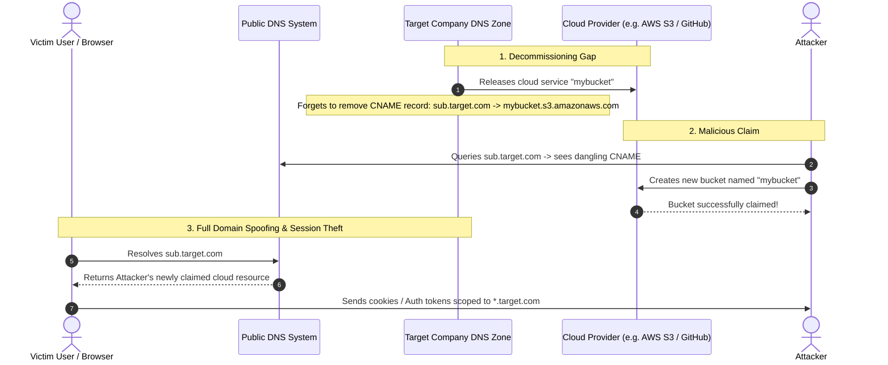

# Mechanism: Subdomain Takeover & Dangling DNS Resolution

## 1. Architectural Vulnerability Profile
*   **Vulnerability Class:** Dangling DNS Pointer / Third-Party Asset Hijacking
*   **STRIDE Category:** Spoofing, Elevation of Privilege, Tampering
*   **Trust Boundary Crossed:** Public DNS Resolver $\rightarrow$ Authoritative Domain Zone $\rightarrow$ Decommissioned Third-Party Cloud Tenant
*   **Target Architectures:** Organizations using SaaS hosting, cloud storage buckets, serverless platforms, or CDN aliases (AWS S3, GitHub Pages, Heroku, Azure, Shopify, Fastly, Zendesk, WordPress).

---

## 2. Core Failure Mechanism



---

## 3. High-Signal Cloud Provider Fingerprints

When probing subdomains via `httpx` or `curl`, look for these signature response bodies indicating claimable assets:

| Cloud Provider | CNAME Target Pattern | Vulnerability Response Signature (Fingerprint) |
|---|---|---|
| **AWS S3 Bucket** | `*.s3.amazonaws.com` | `The specified bucket does not exist` / `NoSuchBucket` |
| **GitHub Pages** | `*.github.io` | `There isn't a GitHub Pages site here.` / `404 Not Found` |
| **Heroku** | `*.herokuapp.com` | `No such app` / `herokucdn.com/error-pages/no-such-app.html` |
| **Azure App Service** | `*.azurewebsites.net` | `404 Web Site not found.` |
| **Shopify** | `*.myshopify.com` | `Sorry, this shop is currently unavailable.` |
| **Fastly CDN** | `*.fastly.net` | `Fastly error: unknown domain:` |
| **Ghost.io** | `*.ghost.io` | `The thing you were looking for is no longer here` |
| **Zendesk** | `*.zendesk.com` | `Help Center Closed` |
| **Surge.sh** | `*.surge.sh` | `project not found` |
| **Bitbucket** | `*.bitbucket.io` | `Repository not found` |
| **Bitly Custom Domain** | `cname.bitly.com` | `Branded Short Domain not claimed` / `Domain is not claimed` |

---

## 4. Offensive Audit & Verification Pipeline

### Step 1: Discover Dangling CNAMEs with `subzy` and `dnsx`
```bash
# Extract CNAME records from resolved subdomains:
cat recon/subs/resolved_subs.txt | dnsx -cname -resp -silent | grep -i "cname" > recon/subs/cnames.txt

# Scan for Subdomain Takeovers across 50+ fingerprint signatures:
subzy run --targets recon/subs/resolved_subs.txt --hide_fails --verify_ssl
```

### Step 2: Manual DNS Verification (`dig`)
```bash
# Verify the CNAME pointer:
dig CNAME sub.target.com +short

# Verify if target IP/host is NXDOMAIN or unallocated:
dig A sub.target.com +short
```

### Step 3: Weaponized Impact & Chaining
1. **Cross-Domain Cookie Theft:** If session cookies are scoped with `Domain=.target.com`, any request to the hijacked subdomain receives all authentication cookies and JWTs.
2. **CORS / PostMessage Hijacking:** Applications with permissive CORS regexes (`*.target.com`) trust the hijacked subdomain, allowing silent full-account data exfiltration.
3. **Phishing & Credential Harvesting:** Users trust SSL certificates generated by the attacker on `sub.target.com` (via Let's Encrypt).

---

## 5. Ethical Proof of Concept (PoC) Doctrine
> [!IMPORTANT]
> **Strict Bug Bounty Rules:** Never deface the page or host malicious files.
> 1. Claim the resource on the third-party provider (e.g. create bucket).
> 2. Host a single static file `bb-poc-<researcher_name>.html` containing:
>    `Subdomain Takeover PoC by [Researcher Name] for Security Assessment.`
> 3. Document the CNAME record, response fingerprint, and ownership proof in the report.

---

## 6. Remediation & Defense
1. **DNS Cleanup Before Service Deprovisioning:** Delete DNS CNAME/A records *before* deleting cloud buckets or SaaS tenants.
2. **Continuous Monitoring:** Run automated tools to detect orphaned CNAMEs pointing to unallocated external namespaces.
